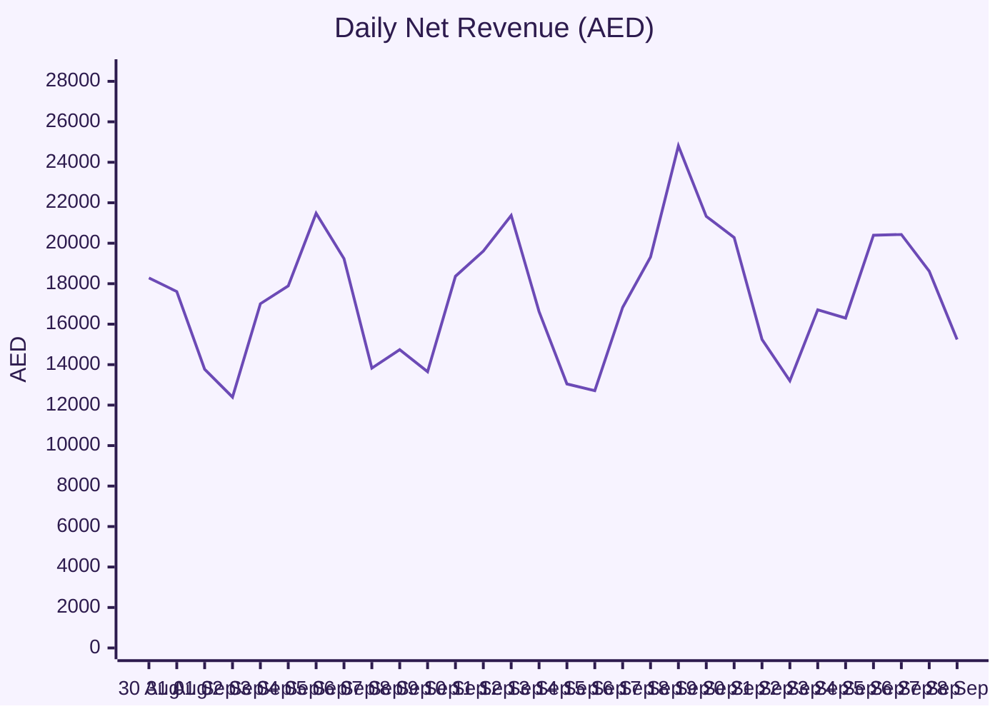
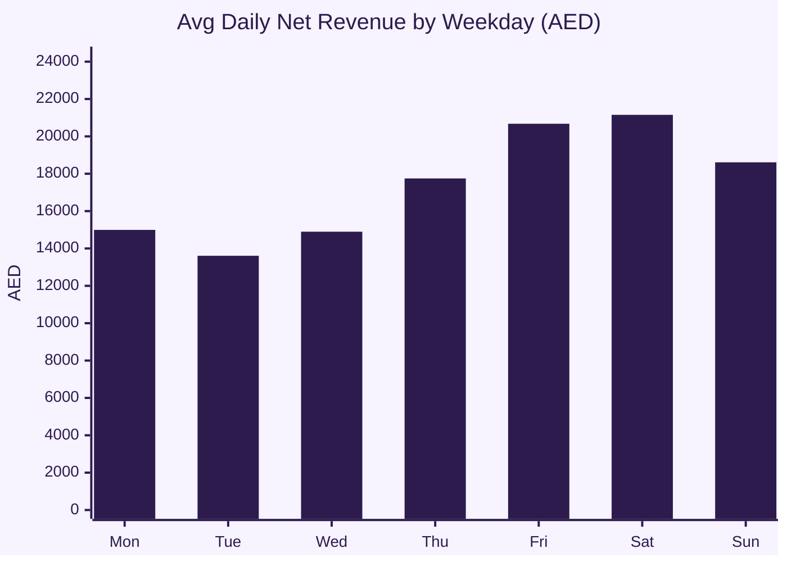
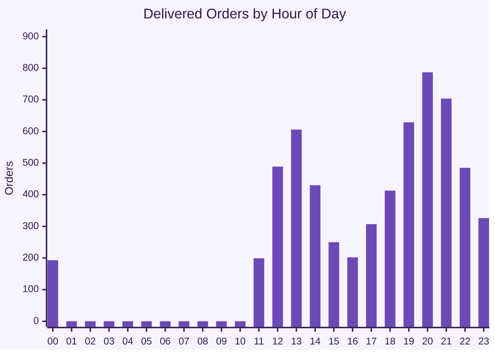
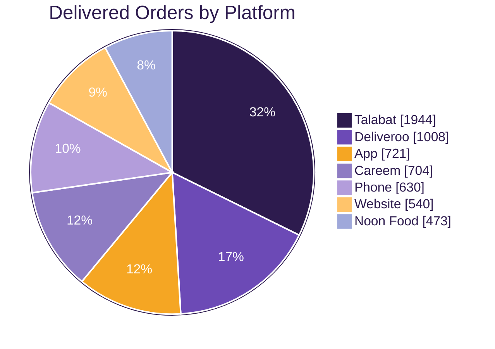
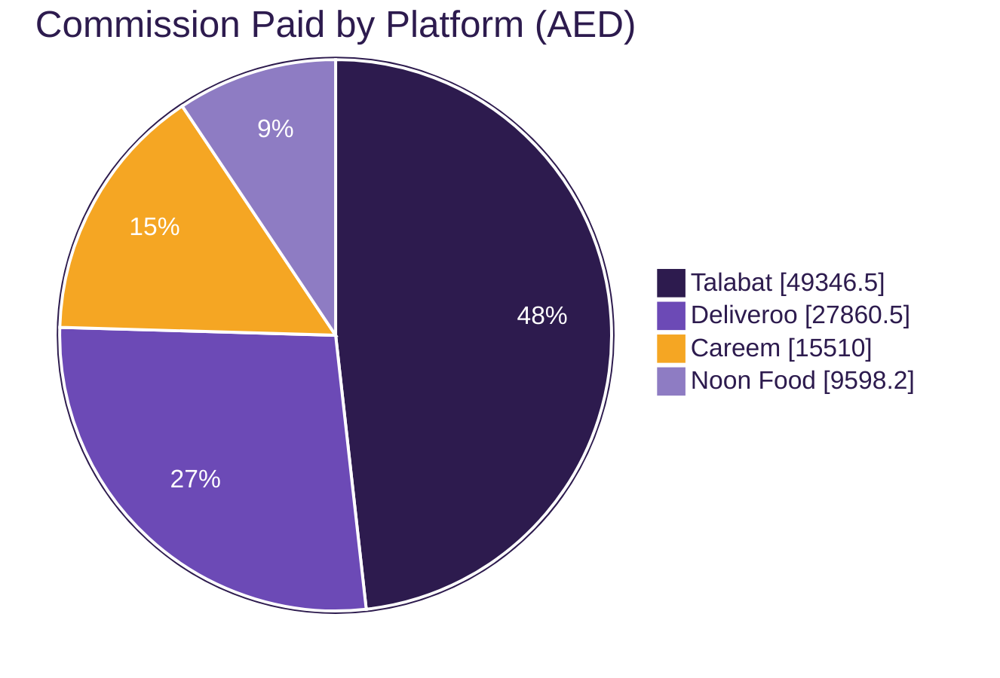
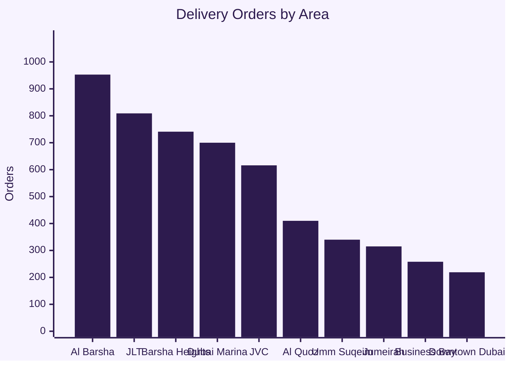
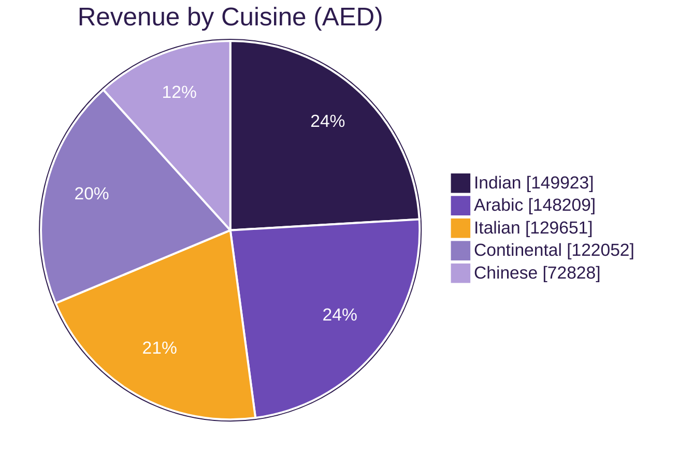
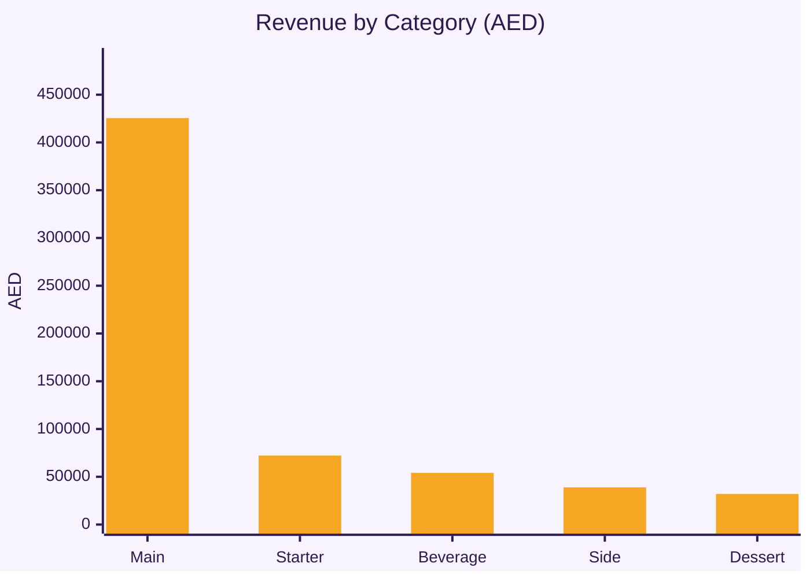
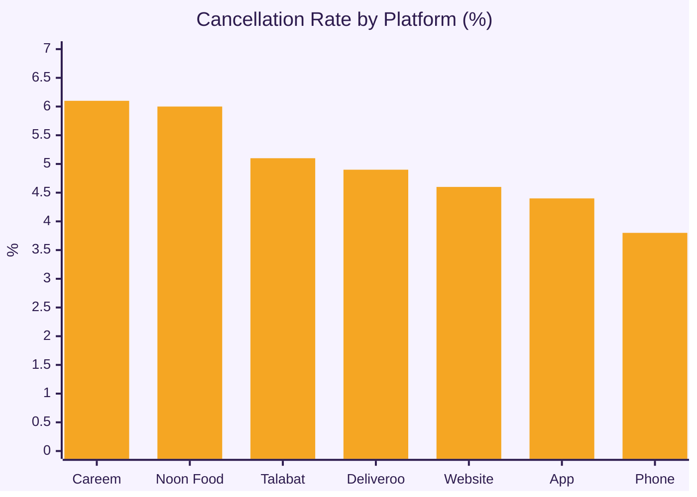

# Restaurant Sales & Operations Dashboard

> Period: **30 Aug 2026 - 28 Sep 2026** | Data: `orders`, `order_items`, `menu`, `platforms`, `areas` (Dubai)
> Revenue figures use **Delivered** orders only. Net revenue = gross - platform commission.

  
  

---

## 1. Key Metrics

| Total Orders | Delivered | Cancelled | Cancel Rate | Gross Sales | Commission Paid | Net Revenue | Avg Order Value |
|:-:|:-:|:-:|:-:|:-:|:-:|:-:|:-:|
| **6,336** | **6,020** | **316** | **5.0%** | **AED 622,663** | **AED 102,315** | **AED 520,348** | **AED 103** |

**Quick insights**
- Aggregators bring **69%** of delivered orders and carry **100%** of the commission bill: **AED 102,315** in total, or 16.4% of gross sales.
- Cancelled orders represent **AED 31,878** of lost gross sales.
- Peak ordering hour is **20:00**; the strongest day of the week is **Sat**.

---

## 2. Operations Speed (minutes, delivered orders)

| Avg Prep Time | Avg Dispatch-to-Delivery | Avg Order-to-Complete |
|:-:|:-:|:-:|
| **19.0** | **13.1** | **38.1** |

---

## 3. Sales Trend

---

## 4. Channels & Platforms

| Platform | Channel | Orders | Cancel % | Commission rate | Gross (AED) | Commission (AED) | Net (AED) | Avg net / order (AED) |
|---|---|---|---|---|---|---|---|---|
| Talabat | Aggregator | 2048 | 5.1% | 25% | 197,386 | 49,346 | 148,040 | 76.2 |
| Phone | Phone | 655 | 3.8% | 0% | 76,485 | 0 | 76,485 | 121.4 |
| Deliveroo | Aggregator | 1060 | 4.9% | 27% | 103,187 | 27,860 | 75,327 | 74.7 |
| App | Direct | 754 | 4.4% | 0% | 73,032 | 0 | 73,032 | 101.3 |
| Careem | Aggregator | 750 | 6.1% | 22% | 70,500 | 15,510 | 54,990 | 78.1 |
| Website | Direct | 566 | 4.6% | 0% | 54,082 | 0 | 54,082 | 100.2 |
| Noon Food | Aggregator | 503 | 6.0% | 20% | 47,991 | 9,598 | 38,393 | 81.2 |

**Delivery vs Pickup**

| Order type | Orders | Gross (AED) | Net (AED) | Avg order (AED) | Share |
|---|---|---|---|---|---|
| Delivery | 5361 | 551,973 | 453,950 | 103 | 89.1% |
| Pickup | 659 | 70,690 | 66,398 | 107 | 10.9% |

---

## 5. Delivery Areas

| Area | Distance (km) | Orders | Net revenue (AED) | Net / order (AED) |
|---|---|---|---|---|
| Al Barsha | 2 | 953 | 80,541 | 84.5 |
| JLT | 5 | 809 | 66,860 | 82.6 |
| Barsha Heights | 3 | 741 | 62,788 | 84.7 |
| Dubai Marina | 6 | 700 | 60,310 | 86.2 |
| JVC | 7 | 616 | 53,520 | 86.9 |
| Al Quoz | 5 | 410 | 34,447 | 84.0 |
| Umm Suqeim | 5 | 340 | 28,485 | 83.8 |
| Jumeirah | 9 | 315 | 26,562 | 84.3 |
| Business Bay | 13 | 258 | 20,735 | 80.4 |
| Downtown Dubai | 14 | 219 | 19,702 | 90.0 |

---

## 6. Menu Performance

**Top 10 dishes by revenue**

| # | Dish | Cuisine | Qty sold | Revenue (AED) |
|---|---|---|---|---|
| 1 | Mixed Grill | Arabic | 389 | 29,175 |
| 2 | Chicken Biryani | Indian | 665 | 27,930 |
| 3 | Butter Chicken | Indian | 599 | 26,955 |
| 4 | Lamb Mandi | Arabic | 434 | 26,908 |
| 5 | Chicken Shawarma Plate | Arabic | 617 | 23,446 |
| 6 | Classic Beef Burger | Continental | 470 | 22,560 |
| 7 | Margherita Pizza | Italian | 470 | 21,150 |
| 8 | Pepperoni Pizza | Italian | 398 | 20,696 |
| 9 | Grilled Salmon | Continental | 250 | 19,500 |
| 10 | Mutton Biryani | Indian | 362 | 18,824 |

---

## 7. Cancellations

---

## Data Files

| File | Description |
|---|---|
| `orders.csv` | One row per order: channel, platform, area, status, amounts, timestamps |
| `order_items.csv` | Line items per order: dish, cuisine, category, qty, price |
| `menu.csv` | Dish master: price, prep minutes, popularity |
| `platforms.csv` | Platform commission rates and mix assumptions |
| `areas.csv` | Delivery areas with distance and order weight |
